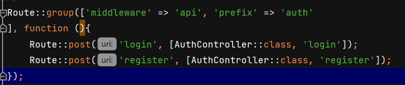
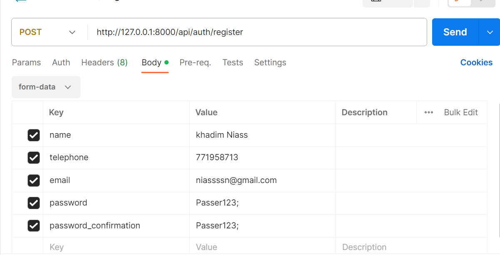
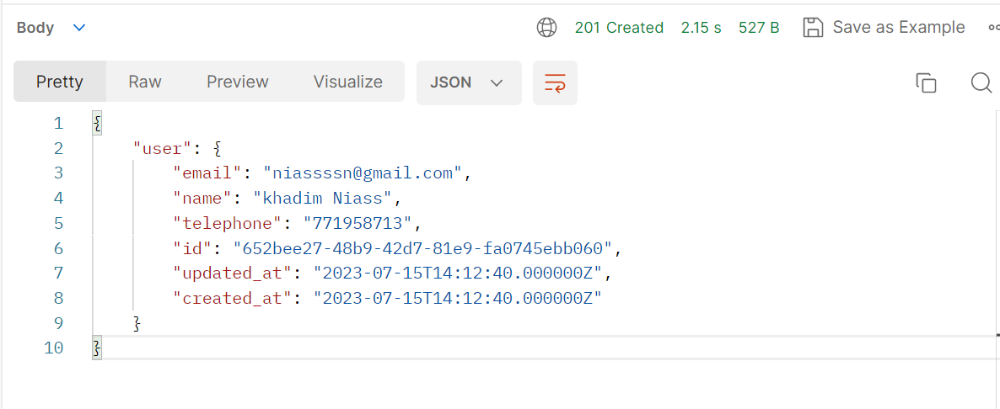
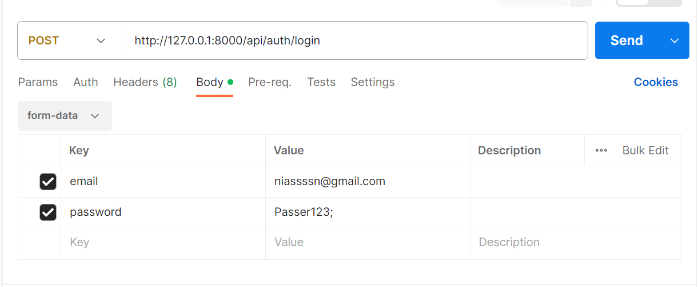
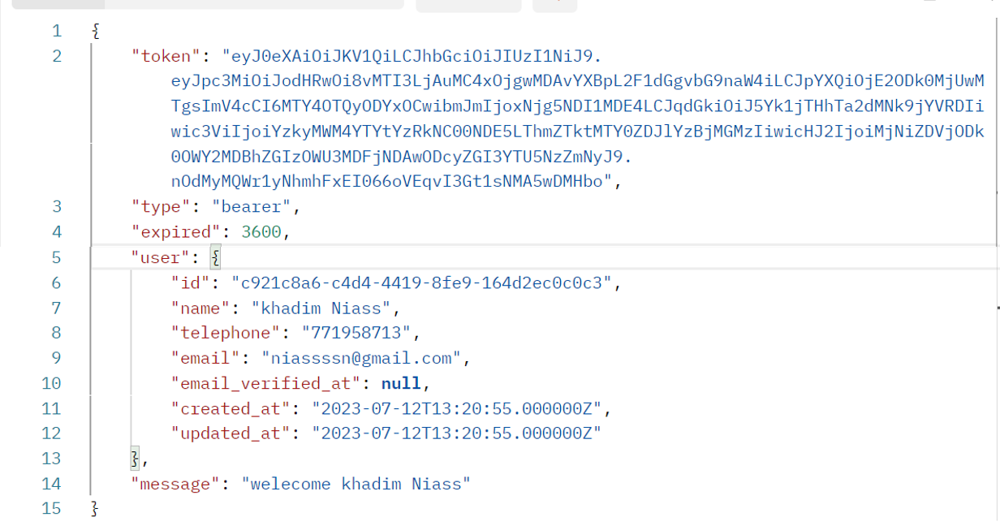

## API laravel avec le systeme d'authentification déjà intégrée.
## c'est le systeme `uuid` qui est mis aussi la logique se trouve dans le fichier `app/Traits/Uuids`

#### la première partie est d'installer la dépendance avec la commande suivante

`composer require tymon/jwt-auth`

'providers' => [

    ...

    Tymon\JWTAuth\Providers\LaravelServiceProvider::class,
]

`php artisan vendor:publish --provider="Tymon\JWTAuth\Providers\LaravelServiceProvider"`

- config/jwt.php :
  -     'ttl' => env('JWT_TTL', 60),
to config the time of token

- Generate secret key

`php artisan jwt:secret`

- configuré le fichier `config/auth.php` 
- changer guard en api

    'defaults' => [
        'guard' => 'api',
        'passwords' => 'users',
    ],

  
- ajouter dans la clés ``'guards' => []`` le bout de code qui suit

  'guards' => [

...

      'api'=>[
          'driver' => 'jwt',
          'provider' => 'users',
          'hash'=>false
      ]
 ],

- Après installation et configuration, on peut définir les routes dans `routes/api.php`

 

donnez vos feed back

[niassssn@gmail.com](mailto:niassssn@gmail.com)

[+221 77 195 87 13](https://wa.me/+221771958713)

<footer>
   <a target="_blank" href="http://khadimniass.me">
      
&copy; 2023 KHADIM NIASS.

   </a>
</footer>

